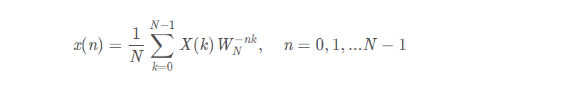

# 基础资料
+ 802.11g是物理层标准。
IEEE802.11g草案有特点：在2．4GHz频段使用正交频分复用（OFDM）调制技术，使数据传输速率提高到20Mbit/s以上；
+ 基带标称采样率为20MHz，子载波个数64, 20MHz/64=312.5KHz。
载波间隔越大，对晶振（导致频偏和采样率偏）的要求越低（成本越低）。当然给定带宽的前提下，间隔太大了符号长度会变小，导致CP冗余比例大。再考虑室内多径的范围，各方面折中一下就出来了。
+ OOK是ASK调制的一个特例，把一个幅度取为0，另一个幅度为非0，就是OOK。（模拟调制）
+ IDFT

+ I/Q是一个射频信号，在极坐标上可以用振幅和相位来表示，在直角坐标上可以用X和Y的值来表示。但在数字通信系统中，一般X用I来代替，表示同相，而Y用Q来代替，表示90°相位。因此产生了所谓I/Q调制器、I/Q解调器以及QPSK（四相键控）调制/解调器。
+ VCO
压控振荡器指输出频率与输入控制电压有对应关系的振荡电路(VCO)，频率是输入信号电压的函数的振荡器VCO，振荡器的工作状态或振荡回路的元件参数受输入控制电压的控制，就可构成一个压控振荡器。
+ PLL
锁相环是一种反馈电路，其作用是使得电路上的时钟和某一外部时钟的相位同步。PLL通过比较外部信号的相位和由压控晶振（VCXO）的相位来实现同步的，在比较的过程中，锁相环电路会不断根据外部信号的相位来调整本地晶振的时钟相位，直到两个信号的相位同步。
+ CSS （zhōu jiū扩频）
+ 最大振幅比 [1]  (largest amplitude ratio)窗函数优化的准则之一在给定窗函数频谱主瓣宽度的条件下，其主瓣幅度与旁瓣最大幅度之比，称为窗函数的振幅比。
+ NLOS非视距最直接的解释是，通信的两点视线受阻，彼此看不到对方，菲涅尔区大于50%的范围被阻挡
# 重要句子
## one
+ 模拟频率合成器是阻碍大规模OFDMA后向散射网络原型的主要原因
+ 此外，OFDMA反向散射可以为标签提供异构连接:可以为一个特定的标签分配4个子载波，这将使标签的数据速率增加4倍。
+ 对于小于1024并发情况下的帧解码，我们首先执行零填充来增加原始符号的长度，以适应1024点FFT的长度。
+ 全数字基带设计在原型设计方面的优势。对比图1所示的模拟频率合成设计和我们提出的全数字基带设计，后者的优点是:它使原型和集成电路仿真更加一致。
+ 全数字处理逻辑完全可以用HDL语言描述，无需建模，使原型设计与集成电路仿真更加一致。锁相环没有很好的描述语言。
## two
+ 任何OFDMA系统的关键都是有效的同步机制，即克服通信实体间硬件分集造成的时间和频率偏移[25,26]。
+ tx-rx同步可以由tx-rx同步机制解决（11g固有）
+ tx-tag发射机解决了这个问题就解决了
+ tag-rx 第五节
+ 我们特意将OOK调制信号和CW的幅度设置为高于常规前置音的幅度。这是为了增加后向散射通信范围和容纳接收机的AGC
+ + 发射器发送的前导信号和标签后向散射的符号依次到达接收端，形成一个完整的OFDM突发。
+ 增强标签距离短是因为这是因为CW的功率被分成4部分来产生4个子载波。
#FAQs
+ 具体地说，如果ACK在接收端被成功解码，它就将ACK发送给发送端。然后发射器将开始发送帧中的ACK位设为1，并将其发送给标签。
# 改进的地方
+ 这是由于W ARP V3平台的限制。这使得NetScatter能够覆盖更大的区域，从而包含更多的并发标记。相比之下，DigiScatter的覆盖范围较小，很难成功触发位于覆盖边缘的标签。换平台？
+ 值得注意的是，信噪比预计会随着标记-rx距离的增加而下降，但我们可以从图22中看到，误码率和吞吐量没有显著变化。这是因为标签的数据发送速率小于tag-rx通道容量;此外，多径效应和其他Wi-Fi ap的现场干扰使rx信噪比与理想自由路径损耗情况不一致。这也解释了图23所示的现象。
+ 太笼统了吧？
+ WiFi有三个通道，直到写这篇文章的时候，我们还没有找到这样一个合适的射频滤波器。
+ WiFi部署的芯片内部信息不可知

# 一些有意思的点

+ 华盛顿大学最先出现，物联网
+ Wi-Fi定位（刘云浩）
+ 第一篇出现Network就是一整套系统了，但没有解释激励信号怎么弄
+ 看两篇的顺序
+ 而这群开发者们正是来自美国华盛顿大学的工程师，他们自去年开始就一直在努力研发这一命名为PoWiFi(Power over Wi-Fi)的创新路由器。
+ 两篇论文一个为前导,第二篇比第一篇早很多（一年）
+ https://www.dropbo
x.com/sh/mdft6dndanbx28l/AACupb5fRpCFAR2VF5SpyCE-a?dl=0被墙了
# 疑问
+ CW是什么 OFDM subcarrier locally generated from the CW
+ 标签（tag）到底是什么 解决 解释标签，类比RFID（其实最早想到的是AprilTag）
+ 那个验证的方法不懂：DD-PLL算法[36]来解决[5]中提到的动态相位偏移。
# 和我契合的
+ 正在学fpga
+ 做过实验，xlinx（您也用过，听不见的声音），Vivado
+ 物联网方向
+ 计网
+ nano，在治疗面瘫里出现过
+ 数学建模（支持向量机，决策树有了解）
# 论文的结构
+ 我们的创新
+ 和现有的比我们的好处
+ technical contributions
+ 可以首先将之前的技术作为入门去介绍，也是基础，再说明有什么问题
+ 出现问题我们的方式怎么解决，但我们想怎么解决要面临什么问题
+ 东西分成块，net就要说全面
+ 实质性测试，和差不多技术的区别
## 优点
+ 东西非常全面，不仅仅是一项技术更多的是体系(硬件上)
+ 想的很多，特别是听不见的声音又从黑客的方向去想会怎么破（软件）
+ 检验的很多，验证很严谨（实验）有障碍和无障碍下的
# 自己的步骤
+ 先说时间少了可能出错要指正
+ 先说优点（整个的优点）
+ 我会什么那两篇吸引我，yolo3，nano，数学建模支持向量机
+ 我怎么看，结构，反向，一些小的方法我不会去深究，这两篇论文的关系
+ 开始我看这个 传感器网络，tag-rfid立马有精神了
+ fpga目前我正在学，verilog，vhdl都会，用的xlinx（要加）
+ 最后说结构（有图片了）
+ 说有意思的地方
+ 还有我的一点小疑问